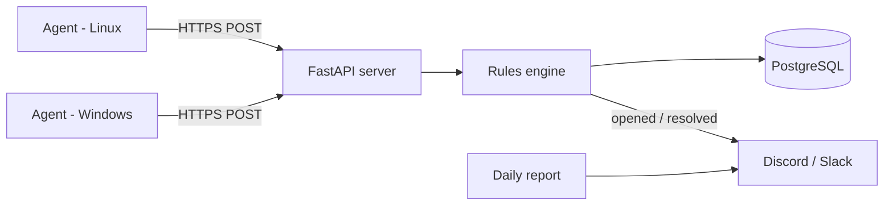

# OpsWatch


**OpsWatch is a self-hosted health-monitoring tool for small IT environments.** Lightweight agents check each machine for full disks, stopped services, stale backups, expiring TLS certificates and pending updates. The server opens a ticket when something breaks, closes it automatically when the problem clears, and posts a daily summary to Discord or Slack.

## Why I built this

During my co-op at a managed IT services provider, I supported about 40 small-business clients across Durham Region. A lot of our tickets came from problems that build up slowly and were easy to catch early: a disk filling up over weeks, a backup job that quietly stopped running, a certificate nobody remembered to renew. Checking for these meant someone logging in and looking by hand.

OpsWatch automates those checks. It's a small-scale version of the remote monitoring and management (RMM) tools MSPs pay for, built so I could learn how they work.

## Features

- **Cross-platform agent** (Linux and Windows). It installs as a systemd service or a Scheduled Task.
- **Built-in checks:**
  - Disk usage per drive
  - Required services are running
  - Backup folder freshness
  - TLS certificate expiry
  - Pending OS updates
- **Deduplicated ticketing:**
  - One ongoing problem creates one ticket, not one per check run.
  - Severity only goes up (warn → crit), never down.
  - Tickets close automatically when the problem is fixed.
- **Alerts and a daily report** sent to any Discord- or Slack-compatible webhook.
- **REST API** with auto-generated OpenAPI docs at `/docs`.
- **Production setup:** Docker Compose, PostgreSQL, a pytest suite, and GitHub Actions CI (lint, tests, Docker build).

## Architecture



Agents **push** results to the server, so client sites don't need to open any inbound ports. Commercial RMM tools work the same way. See [`docs/architecture.md`](docs/architecture.md) for the data model and the design reasoning.

## Quick start

**Requirements:** Docker and Python 3.11+

```bash
git clone https://github.com/JMScripts1/opswatch.git
cd opswatch

# 1. Start the server and database
cp .env.example .env          # then edit the passwords and token
docker compose up -d --build
# API docs: http://localhost:8000/docs

# 2. Run an agent on this machine
python -m venv .venv && source .venv/bin/activate   # Windows: .venv\Scripts\activate
pip install -r agent/requirements.txt
cp agent/config.example.yaml agent/config.yaml      # set agent_token to match .env
cd agent && python -m opswatch_agent.cli --config config.yaml --once

# 3. (Optional) Fill the server with fake multi-client demo data
python scripts/seed_demo.py --token <your AGENT_TOKEN>
```

**Install the agent permanently:**

| OS | Command |
|---|---|
| Linux | `sudo ./scripts/install_agent.sh` |
| Windows (admin PowerShell) | `.\scripts\install_agent.ps1` |

## API

| Method | Endpoint | Description |
|---|---|---|
| `POST` | `/api/v1/reports` | Agent submits check results (requires an `X-Agent-Token` header) |
| `GET` | `/api/v1/hosts` | List the machines being monitored |
| `GET` | `/api/v1/tickets?state=open` | List tickets |
| `POST` | `/api/v1/tickets/{id}/resolve` | Close a ticket manually |
| `GET` | `/health` | Liveness check |

## Development

```bash
pip install -r requirements-dev.txt
make test     # pytest
make lint     # ruff
```

The tests use in-memory SQLite, so you don't need Docker to run them. CI runs lint, the tests and the Docker build on every push.

## Project structure

```
opswatch/
├── agent/                    # Runs on each monitored machine
│   ├── opswatch_agent/
│   │   ├── checks/           # One file per check (disk, services, backups, certs, updates)
│   │   ├── runner.py         # Runs the checks enabled in config
│   │   └── cli.py            # Entry point: run checks, POST to server
│   └── config.example.yaml
├── server/                   # FastAPI + PostgreSQL
│   ├── app/
│   │   ├── routers/          # reports, hosts, tickets endpoints
│   │   ├── services/         # rules engine, notifier, daily report
│   │   ├── models.py         # SQLAlchemy tables
│   │   └── schemas.py        # Pydantic request/response models
│   └── Dockerfile
├── scripts/                  # Agent installers (bash + PowerShell), demo seeder
├── tests/                    # pytest suite
├── docs/architecture.md
├── docker-compose.yml
└── .github/workflows/ci.yml
```

## Roadmap

- [x] **M1: Core loop.** Agent checks → API → deduplicated tickets → webhook alerts
- [ ] **M2: Hardening.**
  - Alembic migrations
  - A token per agent instead of one shared secret
  - HTTPS through a Caddy reverse proxy
  - Alert when an agent stops reporting
- [ ] **M3: Windows parity.** Pending-updates check in PowerShell, Windows Event Log errors, BitLocker status
- [ ] **M4: Dashboard.** A web UI with host status and disk-usage trends from the `check_results` history
- [ ] **M5: Deploy.** A public demo on a cloud VM with real metrics (number of hosts, alert latency)
- [ ] **Next: AI triage.** Classify tickets and suggest fixes using retrieval over runbooks (a separate project that builds on this API)

## What I learned

*Fill this in as you build. Recruiters do read this section.*

- …

## License

MIT
