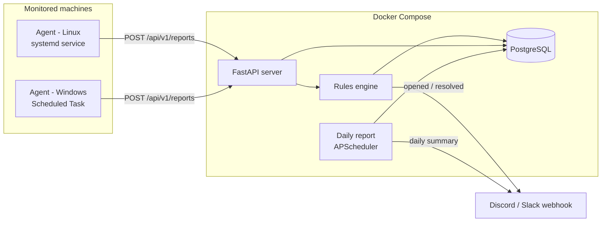

# Architecture

## Why push (agents call in) instead of pull (server polls)?
Client machines in small businesses usually sit behind NAT/firewalls. Outbound HTTPS
from the agent works without opening inbound ports at each site, which is the same
model commercial RMM tools (NinjaOne, Datto RMM, ConnectWise) use.

## Data model
| Table           | Purpose                                                    |
|-----------------|------------------------------------------------------------|
| `hosts`         | One row per machine; `last_seen` updated on every report   |
| `check_results` | Append-only history of every check run (for trends)        |
| `tickets`       | One row per *ongoing problem*, opened/resolved by rules    |

## Ticket lifecycle
`ok → warn/crit` opens a ticket · repeated failures update it (severity only escalates)
· `→ ok` auto-resolves it. One problem = one ticket, no alert spam.
